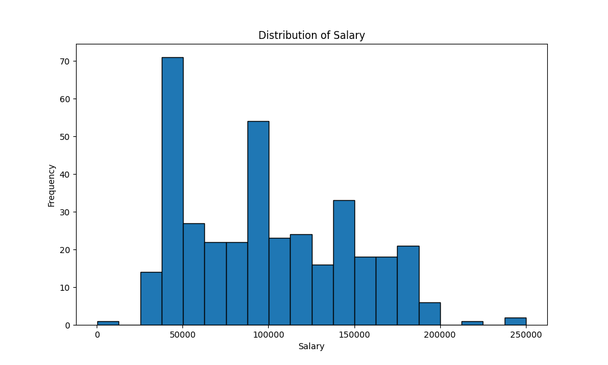
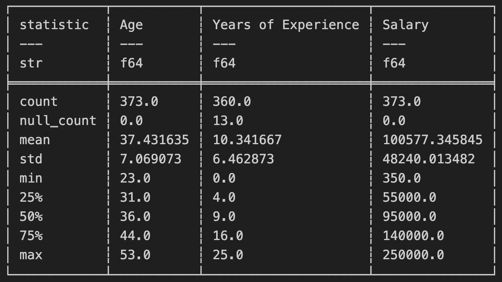

# Leo Chen Mini 12 (Recovered)

## Docker Configuration

- The Docker environment is pre-configured. To run the application, first build the Docker image with `make docker-build`, then run the image with `make docker-run`.
- The program directory is mounted to the Docker container, so there's no need to rebuild the Docker image after making changes to the program. The generated output files, such as reports or visualizations, will automatically appear in your local directory.
- GitHub Actions is configured to automatically push the Docker image to Docker Hub: [kaisenyao/ids706-mini12](https://hub.docker.com/r/kaisenyao/ids706-mini12).

## Dataset Overview

The dataset provides details regarding employee salaries within a company, with each row corresponding to an individual employee. Key attributes include:

- Age: Numerical value in years.
- Gender: Categorized as male or female.
- Education Level: Categorized as high school, bachelor’s degree, master’s degree, or PhD.
- Job Title: Positions like manager, analyst, engineer, or administrator.
- Years of Experience: Numeric value representing work experience.
- Salary: Annual income in US dollars, varying based on job title, experience, and education.

## Project Features

1. A Python script utilizing the Polars library to process the dataset, generate summary statistics, and visualize data distributions. Key results are summarized in a markdown report.
2. Comparison of data analysis using both Pandas and Polars, showcasing performance differences and output similarities.
3. Configured GitHub Actions for continuous integration, automatically testing and running the program, and generating analysis files.
4. Developed a `Makefile` to automate installation, formatting, linting, and testing tasks in the development environment.

## Data Analysis

Key outputs include:

- **Summary Statistics**: Important metrics like mean, median, and standard deviation for numerical fields (`Age`, `Years of Experience`, `Salary`) rounded to two decimal places.
- **Data Visualizations**: Generated a histogram to visualize salary distribution.
  

## Example Output

Below is an example of the summary statistics generated by the script:

